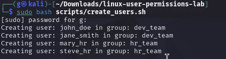
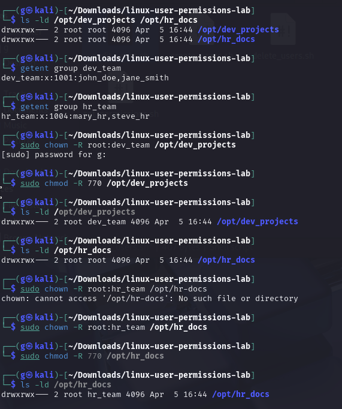
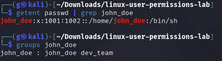
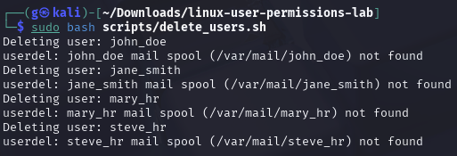

# 🧑‍💻 Linux User & Permissions Management Lab

This lab demonstrates how to manage users, groups, file permissions, and auditing in a Linux environment using Bash scripting.

---

## 📂 Contents

- `create_users.sh` – Bulk create users and assign them to groups
- `delete_users.sh` – Bulk delete users from system
- `set_permissions.sh` – Assign ownership and permissions to team-specific folders
- `audit_users.sh` – View currently logged-in users and last login times
- `users.csv` – Sample user list with group assignments

---

## 🚀 Getting Started

### 1. Bulk Create Users

```bash
sudo bash scripts/create_users.sh
```

### 2. Set Group Folder Permissions

```bash
sudo mkdir -p /opt/dev_projects /opt/hr_docs
sudo bash scripts/set_permissions.sh
```

### 3. Audit Logins

```bash
bash scripts/audit_users.sh
```

### 4. Bulk Delete Users

```bash
sudo bash scripts/delete_users.sh
```

---

## 🛠 Tools Covered

- `useradd`, `usermod`, `groupadd`
- `chown`, `chmod`
- `who`, `lastlog`
- CSV-based automation

---

## 🔐 Use Case Scenarios

- Dev team should only access `/opt/dev_projects`
- HR team should only access `/opt/hr_docs`
- Permission is `770` → full access to group, no access to others

- ## 📸 Screenshots

### 1️⃣ User Creation


---

### 2️⃣ Folder Permissions


---

### 3️⃣ Group Verifications


---

### 4️⃣ User Deletion



---

✅ This lab is a great way to demonstrate system admin fundamentals and can be extended with user password management, SSH key distribution, or sudo rules.
